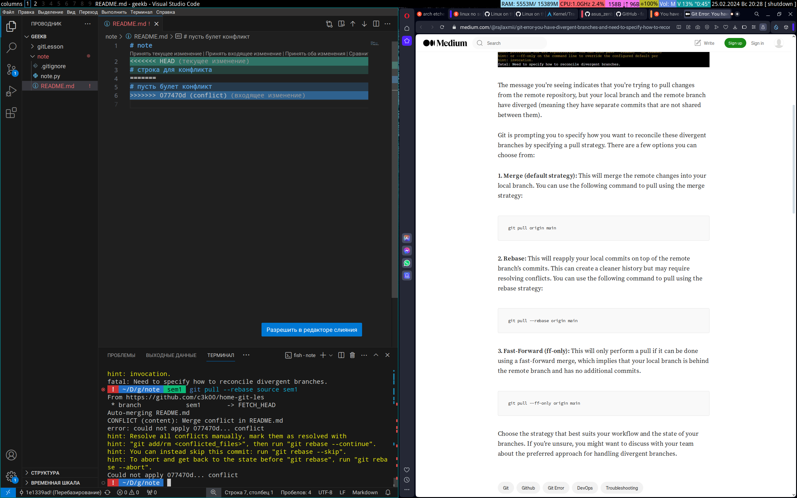

 ~/D/geekb  git clone https://github.com/c3k00/note.git
Cloning into 'note'...
remote: Enumerating objects: 7, done.
remote: Counting objects: 100% (7/7), done.
remote: Compressing objects: 100% (6/6), done.
remote: Total 7 (delta 1), reused 3 (delta 0), pack-reused 0
Receiving objects: 100% (7/7), done.
Resolving deltas: 100% (1/1), done.
 ~/D/geekb  cd ./note/
 ~/D/g/note  main  git remote -v
origin  https://github.com/c3k00/note.git (fetch)
origin  https://github.com/c3k00/note.git (push)
 ~/D/g/note  main  git remote add source https://github.com/c3k00/home-git-les.git
 ~/D/g/note  main  git remote -v
origin  https://github.com/c3k00/note.git (fetch)
origin  https://github.com/c3k00/note.git (push)
source  https://github.com/c3k00/home-git-les.git (fetch)
source  https://github.com/c3k00/home-git-les.git (push)
 ~/D/g/note  main  git push
Everything up-to-date
 ~/D/g/note  main  git push -u source main
Enumerating objects: 7, done.
Counting objects: 100% (7/7), done.
Delta compression using up to 12 threads
Compressing objects: 100% (5/5), done.
Writing objects: 100% (7/7), 3.64 KiB | 3.64 MiB/s, done.
Total 7 (delta 1), reused 7 (delta 1), pack-reused 0
remote: Resolving deltas: 100% (1/1), done.
To https://github.com/c3k00/home-git-les.git
 * [new branch]      main -> main
branch 'main' set up to track 'source/main'.
 ~/D/g/note  main  git remote remove origin
 ~/D/g/note  main  git remote -v
source  https://github.com/c3k00/home-git-les.git (fetch)
source  https://github.com/c3k00/home-git-les.git (push)
 ~/D/g/note  main  git checkout -b sem1
Switched to a new branch 'sem1'
 ~/D/g/note  sem1  git status
On branch sem1
Changes not staged for commit:
  (use "git add <file>..." to update what will be committed)
  (use "git restore <file>..." to discard changes in working directory)
        modified:   README.md

no changes added to commit (use "git add" and/or "git commit -a")
 ~/D/g/note  sem1  git add README.md 
 ~/D/g/note  sem1  git status
On branch sem1
Changes to be committed:
  (use "git restore --staged <file>..." to unstage)
        modified:   README.md

 ~/D/g/note  sem1  git commit -am "conflict"
[sem1 077470d] conflict
 1 file changed, 2 insertions(+), 1 deletion(-)
 ~/D/g/note  sem1  git pull source sem1
remote: Enumerating objects: 5, done.
remote: Counting objects: 100% (5/5), done.
remote: Compressing objects: 100% (2/2), done.
remote: Total 3 (delta 0), reused 0 (delta 0), pack-reused 0
Unpacking objects: 100% (3/3), 1002 bytes | 1002.00 KiB/s, done.
From https://github.com/c3k00/home-git-les
 * branch            sem1       -> FETCH_HEAD
 * [new branch]      sem1       -> source/sem1
hint: You have divergent branches and need to specify how to reconcile them.
hint: You can do so by running one of the following commands sometime before
hint: your next pull:
hint: 
hint:   git config pull.rebase false  # merge
hint:   git config pull.rebase true   # rebase
hint:   git config pull.ff only       # fast-forward only
hint: 
hint: You can replace "git config" with "git config --global" to set a default
hint: preference for all repositories. You can also pass --rebase, --no-rebase,
hint: or --ff-only on the command line to override the configured default per
hint: invocation.
fatal: Need to specify how to reconcile divergent branches.
 !  ~/D/g/note  sem1  git pull --rebase source sem1 
From https://github.com/c3k00/home-git-les
 * branch            sem1       -> FETCH_HEAD
Auto-merging README.md
CONFLICT (content): Merge conflict in README.md
error: could not apply 077470d... conflict
hint: Resolve all conflicts manually, mark them as resolved with
hint: "git add/rm <conflicted_files>", then run "git rebase --continue".
hint: You can instead skip this commit: run "git rebase --skip".
hint: To abort and get back to the state before "git rebase", run "git rebase --abort".
Could not apply 077470d... conflict
